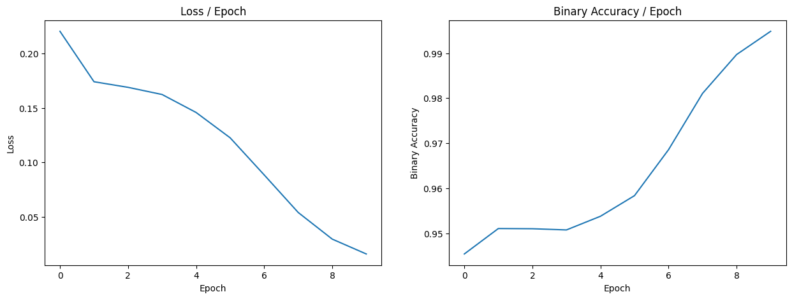

# Resumen de la prueba con fecha 10/06/2023 20:36:40

Tiempo de entrenamiento del modelo: 01 horas 59 minutos 16 segundos
.
## Arquitectura del modelo.

```
Model: "model"

__________________________________________________________________________________________________

 Layer (type)                   Output Shape         Param #     Connected to                     

==================================================================================================

 images (InputLayer)            [(None, 512, 512, 1  0           []                               

                                )]                                                                

                                                                                                  

 Conv2d_2_1_16 (Conv2D)         (None, 128, 128, 16  32          ['images[0][0]']                 

                                )                                                                 

                                                                                                  

 Conv2d_1_1_16 (Conv2D)         (None, 510, 510, 16  160         ['images[0][0]']                 

                                )                                                                 

                                                                                                  

 Up2d_2_2_16 (UpSampling2D)     (None, 512, 512, 16  0           ['Conv2d_2_1_16[0][0]']          

                                )                                                                 

                                                                                                  

 Conv2d_1_2_16 (Conv2D)         (None, 508, 508, 16  2320        ['Conv2d_1_1_16[0][0]']          

                                )                                                                 

                                                                                                  

 Crop2d_2_3_16 (Cropping2D)     (None, 508, 508, 16  0           ['Up2d_2_2_16[0][0]']            

                                )                                                                 

                                                                                                  

 Conc_1_16 (Concatenate)        (None, 508, 508, 32  0           ['Conv2d_1_2_16[0][0]',          

                                )                                 'Crop2d_2_3_16[0][0]']          

                                                                                                  

 max_pooling2d (MaxPooling2D)   (None, 254, 254, 32  0           ['Conc_1_16[0][0]']              

                                )                                                                 

                                                                                                  

 Conv2d_2_1_32 (Conv2D)         (None, 64, 64, 32)   1056        ['max_pooling2d[0][0]']          

                                                                                                  

 Conv2d_1_1_32 (Conv2D)         (None, 252, 252, 32  9248        ['max_pooling2d[0][0]']          

                                )                                                                 

                                                                                                  

 Up2d_2_2_32 (UpSampling2D)     (None, 256, 256, 32  0           ['Conv2d_2_1_32[0][0]']          

                                )                                                                 

                                                                                                  

 Conv2d_1_2_32 (Conv2D)         (None, 250, 250, 32  9248        ['Conv2d_1_1_32[0][0]']          

                                )                                                                 

                                                                                                  

 Crop2d_2_3_32 (Cropping2D)     (None, 250, 250, 32  0           ['Up2d_2_2_32[0][0]']            

                                )                                                                 

                                                                                                  

 Conc_1_32 (Concatenate)        (None, 250, 250, 64  0           ['Conv2d_1_2_32[0][0]',          

                                )                                 'Crop2d_2_3_32[0][0]']          

                                                                                                  

 max_pooling2d_1 (MaxPooling2D)  (None, 125, 125, 64  0          ['Conc_1_32[0][0]']              

                                )                                                                 

                                                                                                  

 Conv2d_2_1_64 (Conv2D)         (None, 32, 32, 64)   4160        ['max_pooling2d_1[0][0]']        

                                                                                                  

 Conv2d_1_1_64 (Conv2D)         (None, 123, 123, 64  36928       ['max_pooling2d_1[0][0]']        

                                )                                                                 

                                                                                                  

 Up2d_2_2_64 (UpSampling2D)     (None, 128, 128, 64  0           ['Conv2d_2_1_64[0][0]']          

                                )                                                                 

                                                                                                  

 Conv2d_1_2_64 (Conv2D)         (None, 121, 121, 64  36928       ['Conv2d_1_1_64[0][0]']          

                                )                                                                 

                                                                                                  

 Crop2d_2_3_64 (Cropping2D)     (None, 121, 121, 64  0           ['Up2d_2_2_64[0][0]']            

                                )                                                                 

                                                                                                  

 Conc_1_64 (Concatenate)        (None, 121, 121, 12  0           ['Conv2d_1_2_64[0][0]',          

                                8)                                'Crop2d_2_3_64[0][0]']          

                                                                                                  

 additional_info (InputLayer)   [(None, 3)]          0           []                               

                                                                                                  

 max_pooling2d_2 (MaxPooling2D)  (None, 60, 60, 128)  0          ['Conc_1_64[0][0]']              

                                                                                                  

 additional_info_dense_1 (Dense  (None, 64)          256         ['additional_info[0][0]']        

 )                                                                                                

                                                                                                  

 flatten (Flatten)              (None, 460800)       0           ['max_pooling2d_2[0][0]']        

                                                                                                  

 additional_info_dense_2 (Dense  (None, 32)          2080        ['additional_info_dense_1[0][0]']

 )                                                                                                

                                                                                                  

 concatenate (Concatenate)      (None, 460832)       0           ['flatten[0][0]',                

                                                                  'additional_info_dense_2[0][0]']

                                                                                                  

 dense_1 (Dense)                (None, 128)          58986624    ['concatenate[0][0]']            

                                                                                                  

 dense_2 (Dense)                (None, 64)           8256        ['dense_1[0][0]']                

                                                                                                  

 outputs (Dense)                (None, 14)           910         ['dense_2[0][0]']                

                                                                                                  

==================================================================================================

Total params: 59,098,206

Trainable params: 59,098,206

Non-trainable params: 0

__________________________________________________________________________________________________

```


## Pérdida y precisión binaria.



## Matriz de confusión.

* Atelectasis
```python
[[875  34]
 [ 85   6]]
```

* Cardiomegaly
```python
[[948   5]
 [ 45   2]]
```

* Consolidation
```python
[[960   3]
 [ 37   0]]
```

* Edema
```python
[[974   6]
 [ 20   0]]
```

* Effusion
```python
[[873  27]
 [ 92   8]]
```

* Emphysema
```python
[[968   3]
 [ 28   1]]
```

* Fibrosis
```python
[[961   4]
 [ 35   0]]
```

* Hernia
```python
[[994   0]
 [  6   0]]
```

* Infiltration
```python
[[744 106]
 [117  33]]
```

* Mass
```python
[[956  10]
 [ 33   1]]
```

* Nodule
```python
[[957   2]
 [ 41   0]]
```

* Pleural_Thickening
```python
[[966   3]
 [ 31   0]]
```

* Pneumonia
```python
[[988   0]
 [ 12   0]]
```

* Pneumothorax
```python
[[948   9]
 [ 40   3]]
```

## Resultados de la clasificación.

```
                    precision    recall  f1-score   support

       Atelectasis       0.15      0.07      0.09        91
      Cardiomegaly       0.29      0.04      0.07        47
     Consolidation       0.00      0.00      0.00        37
             Edema       0.00      0.00      0.00        20
          Effusion       0.23      0.08      0.12       100
         Emphysema       0.25      0.03      0.06        29
          Fibrosis       0.00      0.00      0.00        35
            Hernia       0.00      0.00      0.00         6
      Infiltration       0.24      0.22      0.23       150
              Mass       0.09      0.03      0.04        34
            Nodule       0.00      0.00      0.00        41
Pleural_Thickening       0.00      0.00      0.00        31
         Pneumonia       0.00      0.00      0.00        12
      Pneumothorax       0.25      0.07      0.11        43

         micro avg       0.20      0.08      0.11       676
         macro avg       0.11      0.04      0.05       676
      weighted avg       0.16      0.08      0.10       676
       samples avg       0.05      0.04      0.04       676

```

## Curvas ROC de cada etiqueta.


## Ejemplos de las predicciones del modelo.


    Verde: Clasificación correcta

    Amarillo: Clasificación parcial

    Rojo: Clasificación incorrecta


